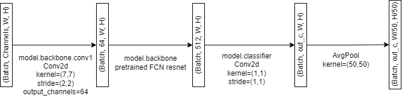

# HW03: Semantic Segmentation and Model Monitoring

## Hungry Hungry Hippos
@Bavhead  
@anakash  
@TanushGo  
@sebseb100  

## Assignment Overview
In this homework we will:
- [ ] Create a baseline deep learning model for semantic segmentation by:
  - [ ] Building a simple CNN segmentation model from scratch.
  - [ ] Use the pre-trained FCNResnet101 to transfer learn the segmentation task on remote sensing data.
  - [ ] Build a UNet segmentation model to experiment with skip connection networks.
- [ ] Use PyTorch Lightning to simplify and decouple training and validation loops. 
- [ ] Monitor model training using Weights and Biases
- [ ] Perform hyperparameter sweeps to select best model hyperparameters.
- [ ] Adapt the code from HW02 to ensure that we can reconstruct ground truth, and prediction subtiles to visually compare.
- [ ] Perform validation to evaluate segmentation task performance using:
  - [ ] Jaccard Index
  - [ ] Intersection over Union
  - [ ] Accuracy
  - [ ] AUC: Area under the Receiver Operator Curve (ROC)
  - [ ] F1-score
- [ ] Profit :moneybag:

## Adaptations to pre-existing files from HW02
- In `src/esd_data/dataset.py` adapt `__getitem__` to return the same output, but the label `y` should be `y-1` because the labeled range goes from 1-4 and in PyTorch the range is zero-indexed (0-3).
- **IMPORTANT:** In `src/esd_data/datamodule.py`:
  - adapt `collate_fn` to return `torch.stack(Xs)` and `torch.stack(ys)`
  - adapt the random validation, train split into a train-validation split amongs the parent tile ids rather than sub-tiles themselves. We need to do this because we want to guarantee that we have all subtiles to restitch back to complete 16x16 images to compare with ground truth images per parent tiles and run evaluation metrics over.
  - To do this change `__load_and_preprocess` to run sci-kit learn's `train_test_split` on the parent tiles and save their respective filepaths to a train list and a validation list. Then when calling the subtiler `grid_slice` from HW02 you save all the respective subtiles in a Train directory or a Val directory with the following recommended paths: `data/processed/<your_ground_truth_subtile_size_dim>/Train` or `data/processed/<your_ground_truth_subtile_size_dim>/Val`. This way you can ensure that you will have all subtiles to a respective parent tile id to enable you to reconstruct your model predictions to the 16x16 dimensions required to visually compare it to the ground truth.

## Images to Save and Inspect
- Visualization of restitched ground truth and predictions from `scripts/evaluate.py`
- Reconstructed 16x16 predictions for each model architecture in `data/predictions/<modelname>`
  
# Modeling

- `__init__`
- `forward`

For more information on how to use PyTorch Lightning with PyTorch as well as helpful tutorials, see:
- [PyTorch Lightning: Basic Skills](https://lightning.ai/docs/pytorch/latest/levels/core_skills.html)
- [A Recipe for Training Neural Networks](http://karpathy.github.io/2019/04/25/recipe/)

## Training
We will train the models using the model architectures defined above in conjunction with the PyTorch Lightning Module for ease of running the training step in `train.py.` To monitor model training make sure to make an account with Weights and Biases for yourself and then create a team. For details on how to get started see [How to Use W&B Teams For Your University Machine Learning Projects for Free](https://wandb.ai/ivangoncharov/wandb-teams-for-students/reports/How-to-Use-W-B-Teams-For-Your-University-Machine-Learning-Projects-For-Free---VmlldzoxMjk1Mjkx).

### `ESDConfig` Python Dataclass
In `train.py` we have created an `ESDConfig` dataclass to store all the paths and parameters for experimenting with the training step. If you notice, in the main function we have provided you with code that utilize the library `argparse` which takes command line arguments using custom flags that allow the user to overwrite the default configurations defined in the dataclass we provided. When running train, for example, if you would like to run training for the architecture `SegmentationCNN` for five epochs you would run:

`python -m scripts.train --model_type=SegmentationCNN --max_epochs=5`

### Hyperparameter Sweeps
We will be using Weights and Biases Sweeps by configuring a yaml file called `sweeps.yml` in order to automate hyperparameter search over metrics such as batch size, epochs, learning rate, and optimizer. You may also experiment with the number of encoders and decoders you would like to add to your model architecture given that you are sensitive to the dimensions of your input image and the dimensions of the output prediction with respect to the ground truth. Some useful articles on how to perform sweeps and use the information to choose the best hyperparameter settings for your model can be found:
- [Tune Hyperparameters](https://docs.wandb.ai/guides/sweeps)
- [Running Hyperparameter Sweeps to Pick the Best Model](https://wandb.ai/wandb_fc/articles/reports/Running-Hyperparameter-Sweeps-to-# U-Net: Segmentation `src/models/unsupervised/unet.py`
Pick-the-Best-Model--Vmlldzo1NDQ0OTIy)

To run training with the hyperparameter sweeps you define in `sweeps.yml` please run `train_sweeps.py --sweep_file=sweeps.yml` provided for you.

## Validation
You will run validation using the script `evaluate.py` where you will load the model weights from the last checkpoint and make a forward pass through your model in order to generate prediction masks. Similar to `ESDConfig` in `train.py`, `EvalConfig` is the dataclass that sets the default configuration for the validation loop when arguments are not passed via command line. Note the use of `argparse` in the main function and its similarities to the `train.py` file.

